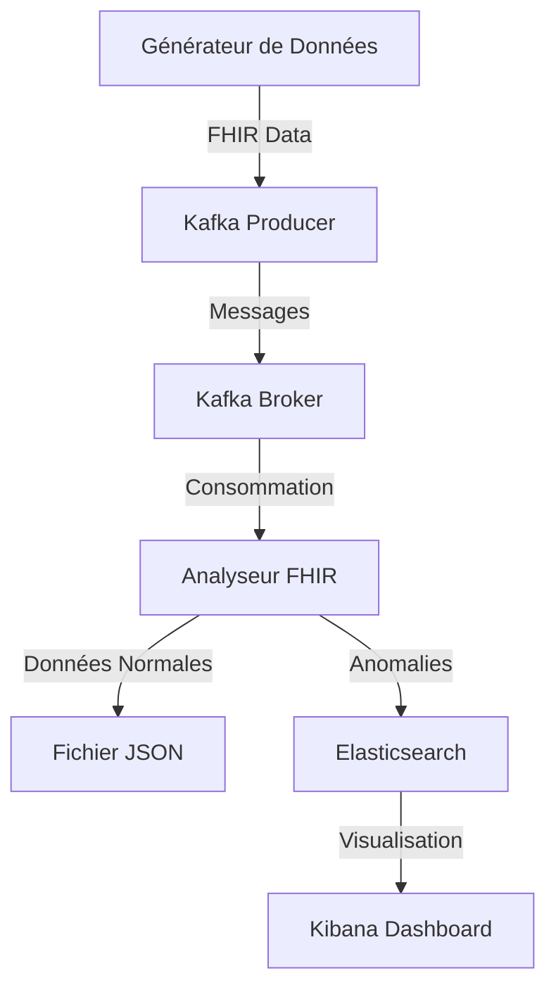

# Système de Surveillance de la Pression Artérielle en Temps Réel

## Description du Projet
Ce projet est un système de surveillance de la pression artérielle qui utilise des standards FHIR (Fast Healthcare Interoperability Resources) pour collecter, traiter et analyser les données de pression artérielle en temps réel.

## Architecture du Système


## Composants du Système

### 1. Générateur de Données (blood_pressure_data_generation.py)
- Génère des données FHIR simulées de pression artérielle
- Crée des observations pour différentes conditions médicales
- Produit des messages vers Kafka

### 2. Analyseur FHIR (fhir_observation_analyzer.py)
- Consomme les messages Kafka
- Analyse les données de pression artérielle
- Détecte les anomalies
- Stocke les résultats dans Elasticsearch

### 3. Infrastructure (docker-compose.yml)
- Kafka et Zookeeper pour le streaming de données
- Elasticsearch pour le stockage
- Kibana pour la visualisation
- Interface utilisateur Kafka pour la surveillance

## Conditions Médicales Surveillées
1. Hypotension (< 90/60 mmHg)
2. Normal (90-119/60-79 mmHg)
3. Élevée (120-129/60-79 mmHg)
4. Hypertension Stade 1 (130-139/80-89 mmHg)
5. Hypertension Stade 2 (140-179/90-119 mmHg)
6. Crise Hypertensive (≥ 180/120 mmHg)

## Installation et Configuration

### Prérequis
- Docker et Docker Compose
- Python 3.8+
- pip (gestionnaire de paquets Python)

### Étapes d'Installation

1. Cloner le dépôt
```bash
git clone <url-du-repo>
cd BloodPressurePrediction
```

2. Installer les dépendances Python
```bash
pip install -r requirements.txt
```

3. Démarrer les services Docker
```bash
docker-compose up -d
```

4. Vérifier les services
- Kafka UI: http://localhost:8080
- Kibana: http://localhost:5601
- Elasticsearch: http://localhost:9200

### Configuration des Services

#### Kafka
- Topic: 'observation'
- Bootstrap servers: localhost:29092
- Interface de gestion: http://localhost:8080

#### Elasticsearch
- Host: localhost
- Port: 9200
- Index: 'patients'

## Utilisation

1. Démarrer le générateur de données
```bash
python blood_pressure_data_generation.py
```

2. Démarrer l'analyseur FHIR
```bash
python fhir_observation_analyzer.py
```

3. Accéder au tableau de bord Kibana
- Ouvrir http://localhost:5601
- Naviguer vers le tableau de bord "Patients"

## Tableaux de Bord Kibana

### Visualisations Disponibles
1. Répartition des Conditions de Tension Artérielle
2. Nombre de Patients en Crise Hypertensive
3. Évolution Hebdomadaire des Moyennes
4. Tendances de la Pression Artérielle

## Maintenance et Support

### Logs et Surveillance
- Les logs Kafka sont stockés dans le volume Docker `kafka_logs`
- Les données Elasticsearch dans le volume `es_data`
- Interface Kafka UI pour la surveillance du streaming

### Résolution des Problèmes Courants
1. Si Kafka ne démarre pas:
```bash
docker-compose restart broker
```

2. Pour réinitialiser les données:
```bash
docker-compose down -v
docker-compose up -d
```

## Sécurité
- Les services sont configurés pour un environnement de développement
- Pour la production, configurer:
  - Authentification Kafka
  - Sécurité Elasticsearch
  - Chiffrement TLS

## Format des Données FHIR
Le système utilise le format FHIR standard pour les observations médicales:
- Pression artérielle: LOINC 85354-9
- Température corporelle: LOINC 8310-5